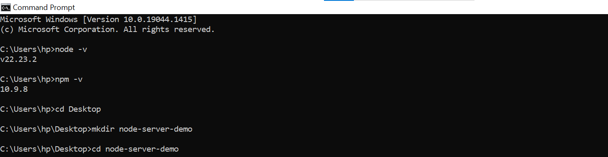
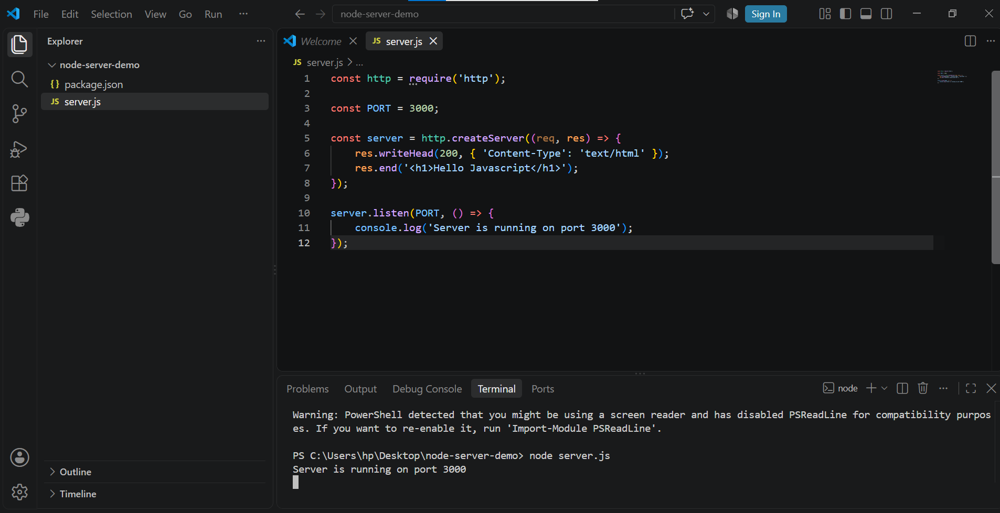
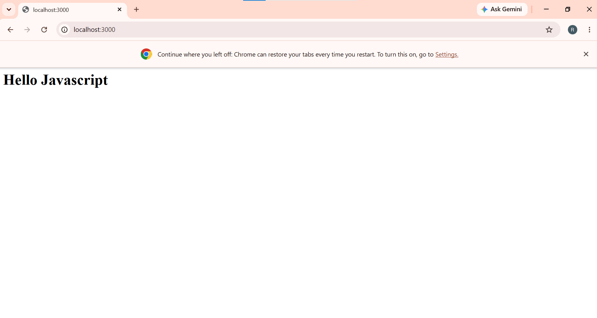

# Node.js Server Demo

This project was created for the Advanced Web Technology practical.

## Objective

To create a basic web server using Node.js that displays:

**Hello Javascript**

## Technologies Used

- Node.js
- JavaScript
- HTTP Module

## Project Structure

- `server.js` — Contains the Node.js HTTP server code.
- `package.json` — Contains the Node.js project configuration.

## How to Run

Open the project folder in the terminal and run:

```bash
node server.js

## Expected Output

The server displays:

**Hello Javascript**

---

# Practical Screenshots

## 1. Node.js and npm Version Check

This screenshot shows that Node.js and npm are installed successfully on the computer.

- Node.js version: `v22.23.2`
- npm version: `10.9.8`



---

## 2. Server Code and Server Running

This screenshot shows the `server.js` file in Visual Studio Code and the terminal output confirming that the Node.js server is running on port 3000.



---

## 3. Browser Output

This screenshot shows the Node.js server running successfully in the browser at `http://localhost:3000` and displaying **Hello Javascript**.



---

## Conclusion

The basic Node.js HTTP server was successfully created and tested. The server responds to a browser request and displays **Hello Javascript**.
